# TP1 — Déploiement d'une API Node.js sur VM Linux

**Étudiant :** Allan Khebab  
**Module :** CDEV — Intégration Continue  
**Date :** Mai 2026  
**Dépôt GitHub :** [Alk2b/TP1_IntegrationContinue](https://github.com/Alk2b/TP1_IntegrationContinue)

---

## Table des matières

1. [Étape 1 — Connexion SSH et sécurisation du pare-feu](#étape-1--connexion-ssh-et-sécurisation-du-pare-feu)
2. [Étape 2 — Création de l'utilisateur applicatif et installation de Node.js](#étape-2--création-de-lutilisateur-applicatif-et-installation-de-nodejs)
3. [Étape 3 — Déploiement de l'application](#étape-3--déploiement-de-lapplication)
4. [Étape 4 — Service systemd et supervision](#étape-4--service-systemd-et-supervision)
5. [Étape 5 — Reverse proxy Nginx](#étape-5--reverse-proxy-nginx)
6. [Étape 6 — Tests de bout en bout](#étape-6--tests-de-bout-en-bout)
7. [Mini-Runbook de maintenance](#mini-runbook-de-maintenance)


---

## Étape 1 — Connexion SSH et sécurisation du pare-feu

### 1.1 Connexion SSH

Connexion réussie en tant qu'utilisateur sudoer `toto` sur la VM Ubuntu 24.04.1 LTS.

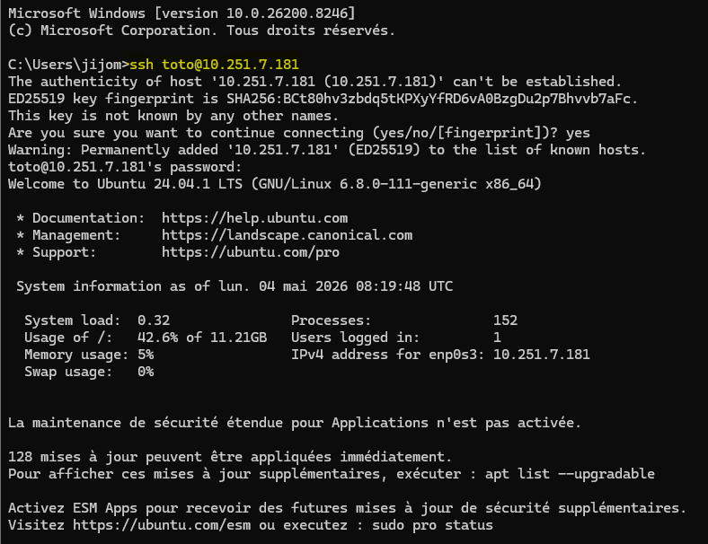

### 1.2 Configuration du pare-feu UFW

Seuls les ports strictement nécessaires sont ouverts : SSH (22), HTTP (80) et HTTPS (443).

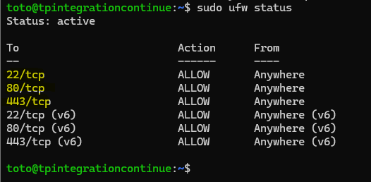

> **Résultat :** UFW actif, règles en place pour les ports 22, 80 et 443 en IPv4 et IPv6.

---

## Étape 2 — Création de l'utilisateur applicatif et installation de Node.js

### 2.1 Création de l'utilisateur `todoapp`

Un utilisateur système dédié est créé sans répertoire home ni shell interactif.

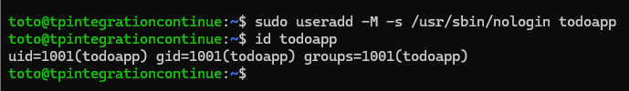

> **Résultat :** `uid=1001(todoapp)`, shell `/usr/sbin/nologin` — aucun accès shell direct possible.

### 2.2 Installation de Node.js 20 LTS

Ajout du dépôt NodeSource et installation de Node.js 20.

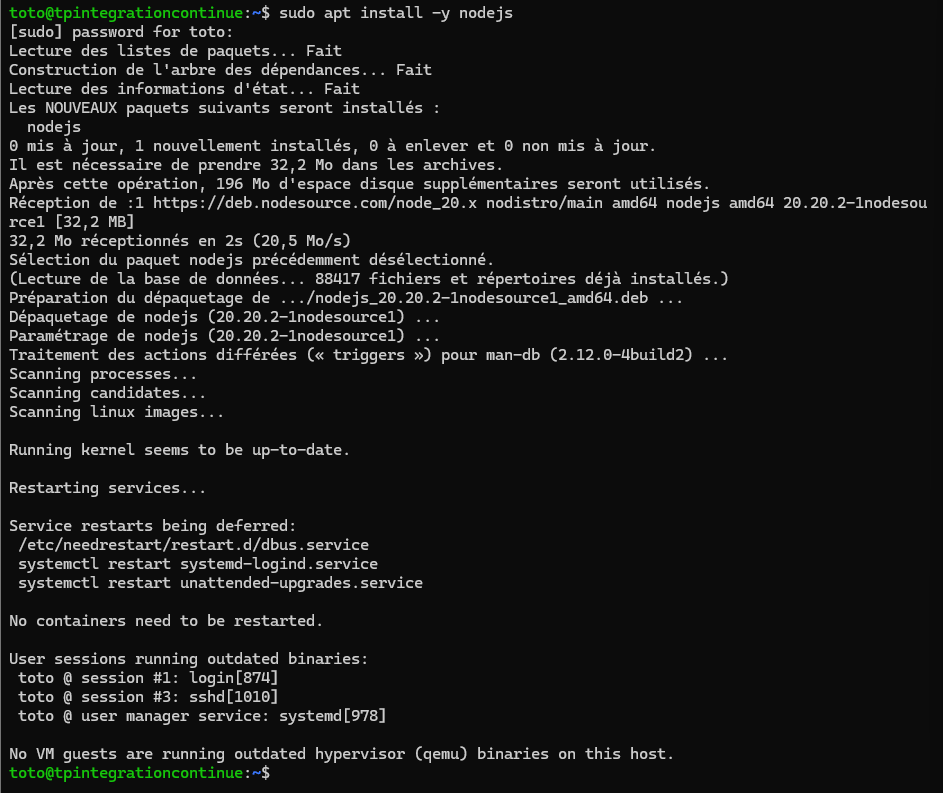

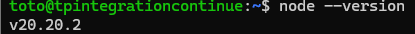

> **Résultat :** Node.js `v20.20.2` installé.

### 2.3 Installation des outils de compilation

Nécessaires pour compiler les dépendances natives (notamment `better-sqlite3`).


---

## Étape 3 — Déploiement de l'application

### 3.1 Création des répertoires

Trois répertoires sont créés avec les bonnes permissions pour l'utilisateur `todoapp` :

| Répertoire | Rôle |
|---|---|
| `/opt/todo-api` | Code source de l'application |
| `/var/lib/todo-api` | Fichier de base de données SQLite |
| `/var/log/todo-api` | Fichiers de logs applicatifs |

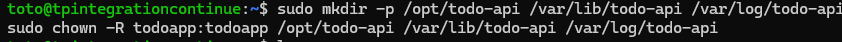

### 3.2 Clonage du dépôt GitHub

Le code source est cloné directement dans `/opt/todo-api` en tant qu'utilisateur `todoapp`.

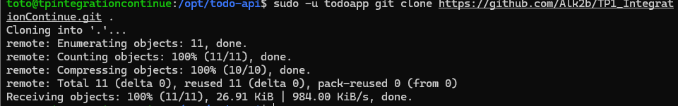

### 3.3 Installation des dépendances de production

`npm ci --omit=dev` garantit une installation reproductible, sans les dépendances de développement (ESLint, etc.).

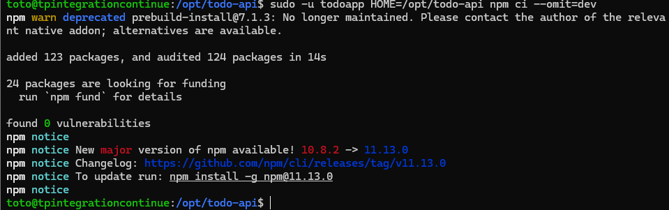

> **Résultat :** 123 paquets installés, 0 vulnérabilité.

> **Difficulté rencontrée :** Lors d'une première tentative avec `sudo -u todoapp npm ci --omit=dev` sans préciser `HOME`, npm a planté avec une erreur `EACCES: permission denied, mkdir '/home/todoapp'`. C'est en réalité logique : j'avais créé l'utilisateur `todoapp` avec l'option `-M` exprès pour qu'il n'ait pas de dossier personnel, mais npm essaie par défaut d'y créer son cache. En précisant `HOME=/opt/todo-api`, on redirige npm vers un dossier qui appartient à `todoapp`, et l'installation se passe sans problème.

### 3.4 Création du fichier d'environnement `.env`

Le secret JWT est généré aléatoirement avec `openssl` pour garantir son imprévisibilité.

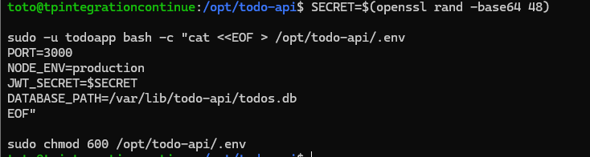

> `chmod 600` : seul l'utilisateur propriétaire peut lire le fichier — le secret JWT n'est pas exposé.

### 3.5 Initialisation de la base de données SQLite

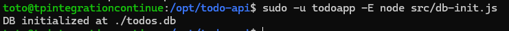

> **Résultat :** `DB initialized at ./todos.db` — schéma créé dans `/var/lib/todo-api/todos.db`.

### 3.6 Test de démarrage manuel

Vérification que le serveur démarre correctement avant de le confier à systemd.

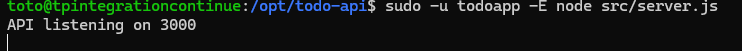

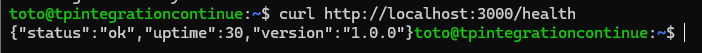

> **Résultat :** `{"status":"ok","uptime":30,"version":"1.0.0"}` — l'API répond correctement.

---

## Étape 4 — Service systemd et supervision

### 4.1 Création du fichier de service

Le fichier `/etc/systemd/system/todo-api.service` configure le démarrage automatique et les restrictions de sécurité.

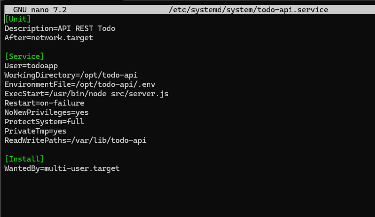

### 4.2 Activation et démarrage du service

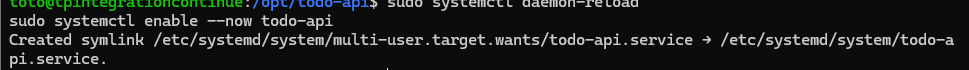

> `enable --now` : active le démarrage automatique au boot ET démarre le service immédiatement.

### 4.3 Vérification du statut

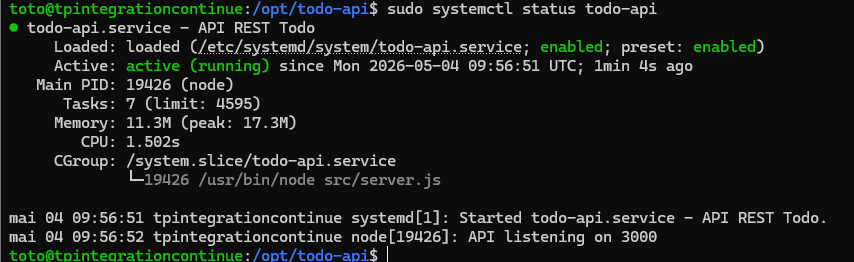

> **Résultat :** `active (running)` — service démarré le 2026-05-04 à 09:56:51 UTC, PID 19426.

### 4.4 Test de résistance — Simulation de crash

Vérification que systemd redémarre automatiquement le processus en cas de crash.

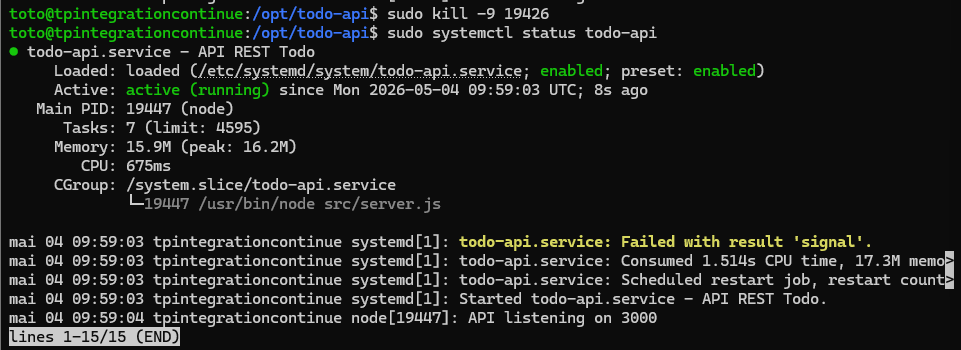

> **Résultat :** systemd détecte `Failed with result 'signal'`, planifie un redémarrage, et l'API repart avec un nouveau PID (19447). La directive `Restart=on-failure` fonctionne correctement.

> **Réflexion :** Ce résultat est exactement celui attendu. Le `kill -9` simule un crash brutal que l'application ne peut pas intercepter. On voit dans les logs que systemd a détecté la mort du processus, a noté le motif (`Failed with result 'signal'`), puis a automatiquement planifié et exécuté un redémarrage grâce à la ligne `Restart=on-failure` du fichier de service. L'API est repartie sous un nouveau PID sans aucune intervention manuelle — c'est exactement le comportement qui était attednu notamment pour un serveur en prod

---

## Étape 5 — Reverse proxy Nginx

### 5.1 Installation de Nginx

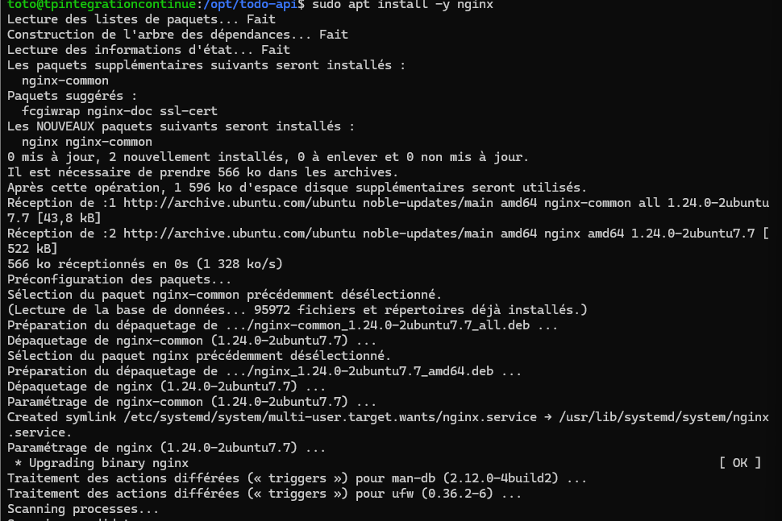

> **Résultat :** Nginx `1.24.0-2ubuntu7.7` installé.

### 5.2 Configuration du virtual host

Fichier `/etc/nginx/sites-available/todo-api` :

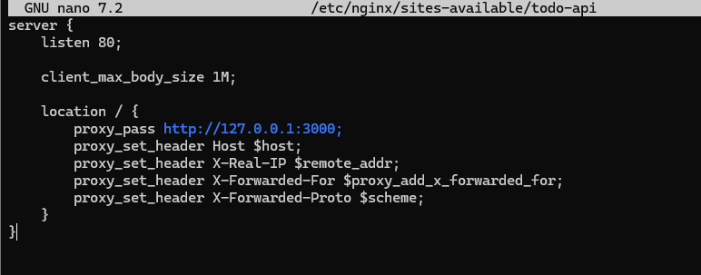

### 5.3 Activation du site et désactivation du site par défaut

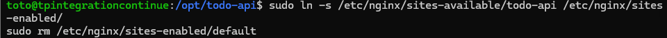

### 5.4 Test de la configuration et rechargement

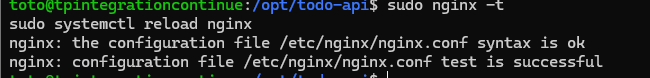

> **Résultat :** `syntax is ok` — `test is successful` — configuration valide, Nginx rechargé sans interruption.

---

## Étape 6 — Tests de bout en bout

### 6.1 Test depuis le navigateur

Accès à `http://10.251.7.181/health` depuis le navigateur du poste de développement — le trafic transite bien par Nginx (port 80) puis est proxifié vers l'API sur le port 3000.

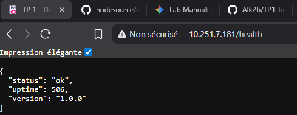

> **Résultat :** `{"status":"ok","uptime":506,"version":"1.0.0"}` — l'API est accessible publiquement via Nginx.

> **Réflexion :** Cette capture prouve en réalité trois choses en même temps : Nginx fonctionne et écoute bien sur le port 80 ; le reverse proxy fait son travail en redirigeant silencieusement la requête vers l'API Node.js sur le port 3000, qui lui n'est jamais exposé directement à l'extérieur ; et le pare-feu UFW est bien configuré puisqu'il laisse passer le trafic HTTP depuis l'extérieur. Le fait que le navigateur affiche la réponse JSON de l'API valide toute la chaîne d'un coup.

### 6.2 Test d'authentification JWT

**Obtention d'un token** via un `POST /login` :

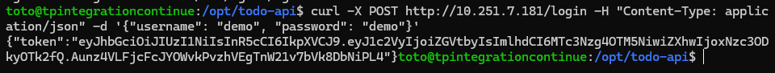

> **Résultat :** Token JWT retourné dans la réponse JSON (`{"token":"eyJ..."}`).

**Utilisation du token** pour accéder à une route protégée :

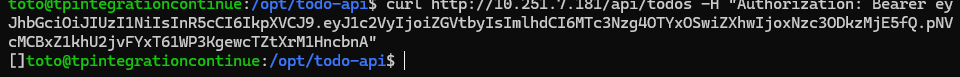

> **Résultat :** `[]` — liste des todos retournée (vide à l'initialisation). Le token est validé par l'API.

---

## Mini-Runbook de maintenance

### 1. Redémarrer le service

```bash
sudo systemctl restart todo-api
```

### 2. Consulter les logs (50 dernières lignes en temps réel)

```bash
sudo journalctl -u todo-api -n 50 -f
```

### 3. Déployer une nouvelle version

```bash
cd /opt/todo-api
sudo -u todoapp git pull
sudo -u todoapp HOME=/opt/todo-api npm ci --omit=dev
sudo systemctl restart todo-api
```

### 4. Effectuer un rollback

```bash
cd /opt/todo-api
sudo -u todoapp git checkout <hash_du_commit_précédent>
sudo -u todoapp HOME=/opt/todo-api npm ci --omit=dev
sudo systemctl restart todo-api
```

> Identifier le commit cible avec `git log --oneline`.

### 5. Régénérer le `JWT_SECRET`

```bash
sudo nano /opt/todo-api/.env   # modifier la valeur JWT_SECRET
sudo systemctl restart todo-api
```

> **Impact :** Tous les tokens JWT  deviennent immédiatement inutilisables.

### 6. Diagnostiquer un problème Nginx

```bash
sudo nginx -t                          # vérifie la syntaxe de la configuration
sudo journalctl -u nginx -n 50        # consulte les logs Nginx
sudo systemctl status nginx           # statut du processus
```

> La commande `nginx -t` va indiquer la ligne exacte de l'erreur dans les fichiers de configuration.

---

*Compte rendu rédigé à l'issue de la réalisation complète du TP1.*