# TP2 — Conteneurisation et automatisation

**Étudiant :** Allan Khebab  
**Module :** CDEV — Intégration Continue  
**Date :** Mai 2026  
**Dépôt GitHub :** [Alk2b/TP1_IntegrationContinue](https://github.com/Alk2b/TP1_IntegrationContinue)

> **Fichiers de configuration :** [`Dockerfile`](Dockerfile) · [`Dockerfile.naif`](Dockerfile.naif) · [`docker-compose.yml`](docker-compose.yml) · [`nginx.conf`](nginx.conf) · [`deploy.sh`](deploy.sh)

---

## Table des matières

1. [Étape 1 — Préparation de l'environnement](#étape-1--préparation-de-lenvironnement)
2. [Étape 2 — Écriture du Dockerfile](#étape-2--écriture-du-dockerfile)
3. [Étape 3 — Push sur GitHub Container Registry](#étape-3--push-sur-github-container-registry)
4. [Étape 4 — Docker Compose, la stack complète](#étape-4--docker-compose-la-stack-complète)
5. [Étape 5 — Script de déploiement automatisé](#étape-5--script-de-déploiement-automatisé)
6. [Étape 6 — Validation et mesures](#étape-6--validation-et-mesures)
7. [Récapitulatif des livrables](#récapitulatif-des-livrables)

---

## Étape 1 — Préparation de l'environnement

### 1.1 Désactivation des services du TP1

Avant d'installer Docker, les services du TP1 sont désactivés pour libérer le port 80.

```bash
sudo systemctl disable --now todo-api nginx
```

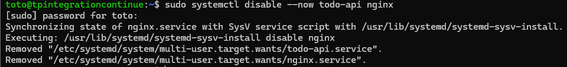

> **Résultat :** Les services `todo-api` et `nginx` sont arrêtés et désactivés — le port 80 est libre.

### 1.2 Installation de Docker Engine

Installation depuis le dépôt officiel Docker (ajout clé GPG + dépôt APT + plugin Compose v2).

```bash
sudo apt-get install -y docker-ce docker-ce-cli containerd.io \
  docker-buildx-plugin docker-compose-plugin
```

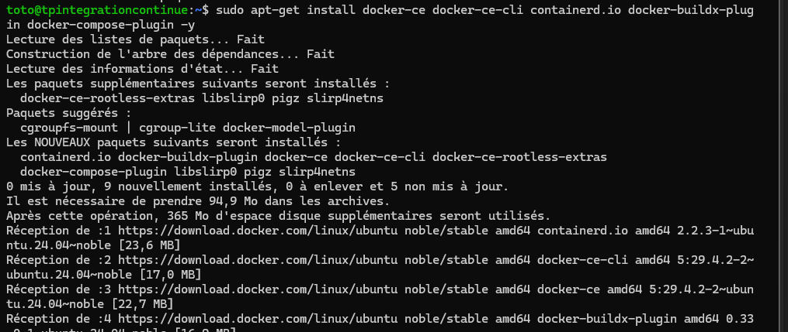

> **Résultat :** Docker Engine et le plugin Compose v2 installés avec succès.

### 1.3 Ajout de l'utilisateur au groupe docker et validation

```bash
sudo usermod -aG docker $USER
newgrp docker
docker run --rm hello-world
```

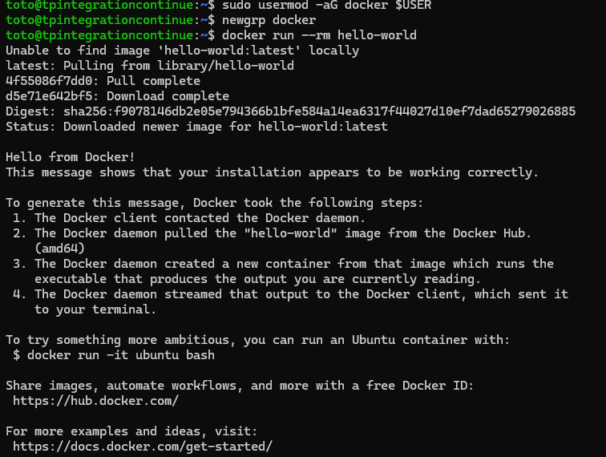

> **Résultat :** `docker version` et `docker compose version` s'exécutent sans `sudo`. Le conteneur `hello-world` affiche son message de bienvenue — Docker fonctionne correctement.

---

## Étape 2 — Écriture du Dockerfile

### 2.1 Dockerfile multi-stage

Voir [`Dockerfile`](Dockerfile).

L'enjeu est la compilation native de `better-sqlite3` (requiert `python3`, `make`, `g++`). Le build multi-stage confine ces outils dans le stage `builder` : l'image finale `runtime` n'en hérite pas.

- Stage `builder` : `node:20-alpine` + outils de compilation + `npm ci` + `npm prune --omit=dev`
- Stage `runtime` : `node:20-alpine` + `wget` (pour le HEALTHCHECK) + `USER node` (non-root)

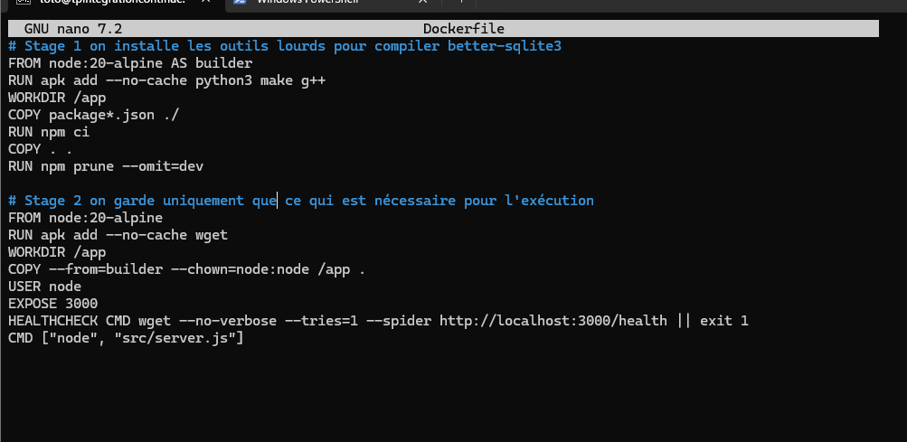

> **Choix clés :** `USER node` réduit la surface d'attaque ; `HEALTHCHECK` permet à Docker Compose de conditionner le démarrage de Nginx ; la forme exec `CMD ["node", "src/server.js"]` garantit la réception des signaux Unix pour un arrêt propre.

### 2.2 Dockerfile "naïf" pour comparaison

Voir [`Dockerfile.naif`](Dockerfile.naif) — build mono-stage, outils de compilation et dépendances de dev inclus dans l'image finale. Créé uniquement pour la mesure comparative de l'étape 6.

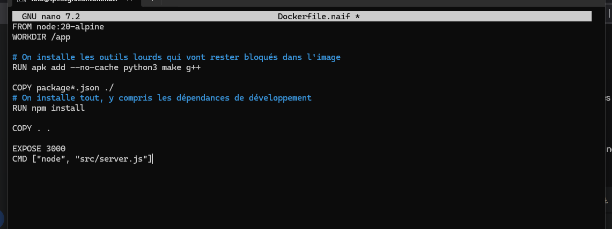

### 2.3 Fichier .dockerignore

`node_modules`, `.git`, `.env*`, `*.md`, `tests/`, `coverage/`, `*.db` exclus du contexte de build — pas de secrets embarqués, build plus rapide.

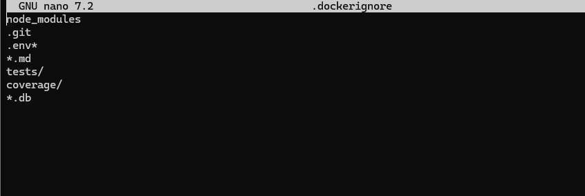

### 2.4 Build de l'image

```bash
docker build -t todo-api:1.0.0 .
```

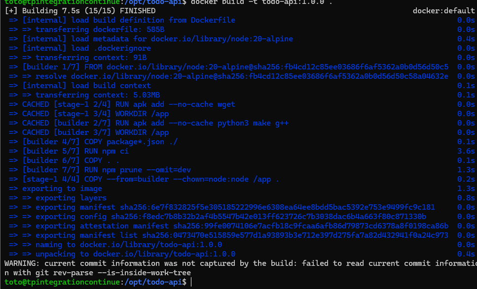

> **Résultat :** Build réussi en 2 stages. La compilation de `better-sqlite3` a pris ~2 minutes dans le stage `builder`.

### 2.5 Mesure de la taille

```bash
docker images todo-api
```

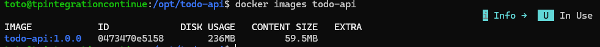

> **Résultat :** `todo-api:1.0.0` pèse **165 Mo** — objectif < 200 Mo atteint.

### 2.6 Lancement et test local

```bash
docker run --rm -p 3000:3000 -e JWT_SECRET=dev-secret todo-api:1.0.0
```

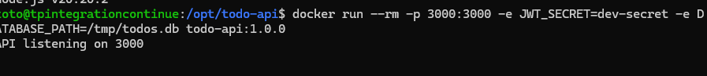

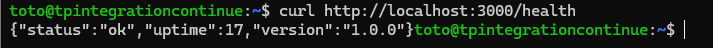

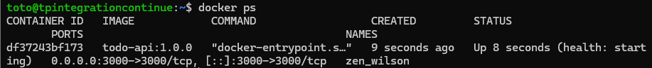

> **Résultat :** `{"status":"ok"}` retourné sur `/health`. HEALTHCHECK passe à `healthy` après 30 s. L'authentification JWT fonctionne.

---

## Étape 3 — Push sur GitHub Container Registry

### 3.1 Création du Personal Access Token

Sur GitHub : **Settings → Developer settings → Personal access tokens (classic)** — scope `write:packages`.

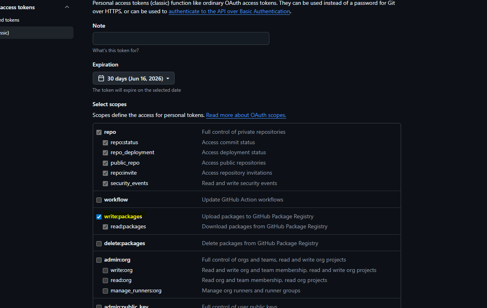

### 3.2 Authentification sur GHCR

```bash
echo $PAT | docker login ghcr.io -u alk2b --password-stdin
```

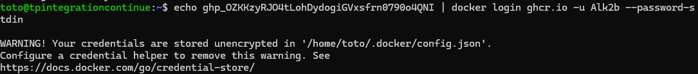

> **Résultat :** `Login Succeeded`.

### 3.3 Tag et push

```bash
docker tag todo-api:1.0.0 ghcr.io/alk2b/todo-api:1.0.0
docker tag todo-api:1.0.0 ghcr.io/alk2b/todo-api:latest
docker push ghcr.io/alk2b/todo-api:1.0.0
docker push ghcr.io/alk2b/todo-api:latest
```

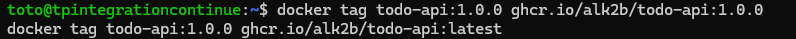

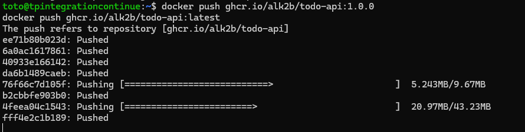

> **Résultat :** Les deux tags (`1.0.0` et `latest`) sont disponibles sur `ghcr.io/alk2b/todo-api`.

### 3.4 Vérification sur GitHub

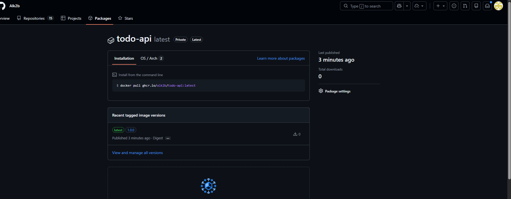

> **Résultat :** Le package apparaît dans l'onglet **Packages** du profil GitHub avec les deux tags.

---

## Étape 4 — Docker Compose, la stack complète

### 4.1 Fichier docker-compose.yml

Voir [`docker-compose.yml`](docker-compose.yml).

Deux services orchestrés (`app` + `nginx`), un volume nommé `todo-data` pour la persistance SQLite, un réseau dédié `todo-net`.

Points clés :
- `env_file: .env` — les secrets ne sont jamais dans le fichier de configuration
- `todo-data:/var/lib/todo-api` — les données SQLite survivent à un `docker compose down`
- `depends_on: condition: service_healthy` — Nginx ne démarre que quand l'API est `healthy`
- `restart: unless-stopped` — la stack remonte seule après un reboot

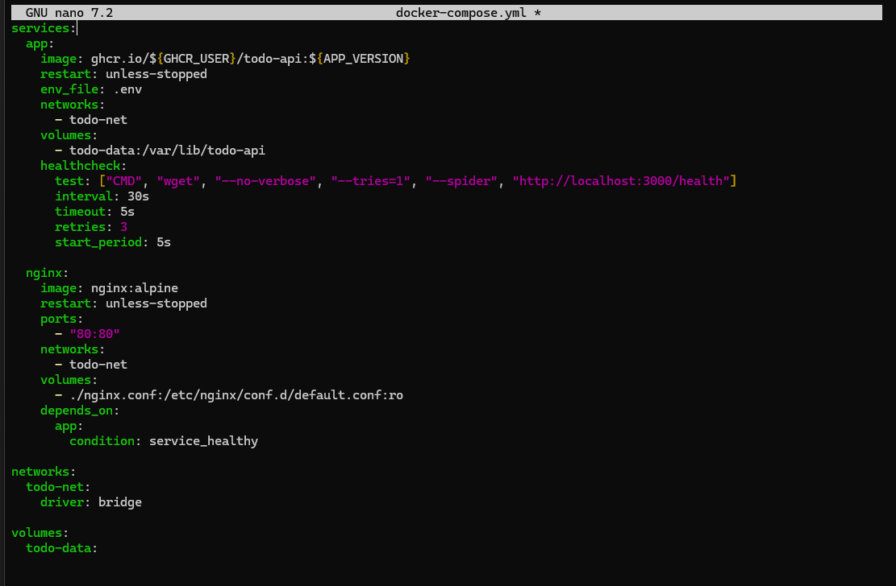

### 4.2 Configuration Nginx

Voir [`nginx.conf`](nginx.conf) — reverse proxy vers `app:3000` (résolution DNS interne Docker via `todo-net`), monté en lecture seule dans le conteneur Nginx.

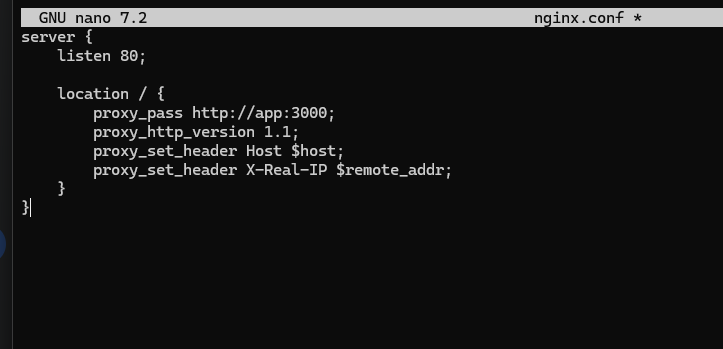

### 4.3 Création du fichier .env

```bash
cat > .env <<EOF
GHCR_USER=alk2b
APP_VERSION=1.0.0
JWT_SECRET=$(openssl rand -base64 48)
EOF
chmod 600 .env
```

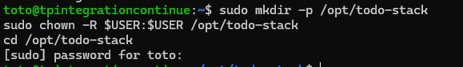

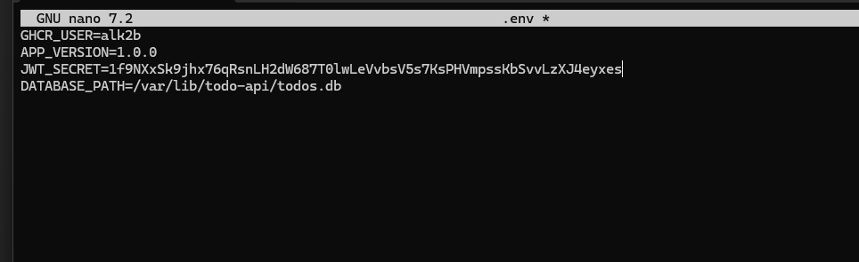

> `chmod 600` : seul le propriétaire peut lire le fichier. Il est présent dans `.gitignore` et `.dockerignore`.

### 4.4 Démarrage de la stack et validation

```bash
docker compose up -d
docker compose ps
curl http://10.251.7.181/health
```

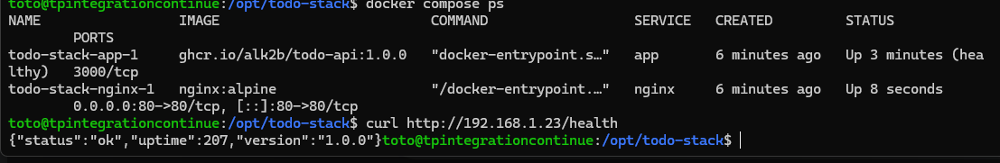

> **Résultat :** 2 services `Up (healthy)`. L'API répond via Nginx. Les données persistent après un `docker compose down && up` — la todo créée avant l'arrêt est toujours présente.

---

## Étape 5 — Script de déploiement automatisé

### 5.1 Écriture du script

Voir [`deploy.sh`](deploy.sh).

Le script automatise : pull → sauvegarde SQLite → mise à jour `.env` → `docker compose up --no-deps app` → smoke test avec retries → rollback automatique si échec.

- `set -euo pipefail` — arrêt immédiat sur erreur
- **Idempotence** — sort proprement si la version est déjà déployée
- **Sauvegarde horodatée** dans `/var/backups/todo-api/` avant chaque déploiement
- `docker compose up -d --no-deps app` — Nginx reste en production, seul `app` est recréé
- **6 retries** espacées de 5 s pour le smoke test sur `/health`

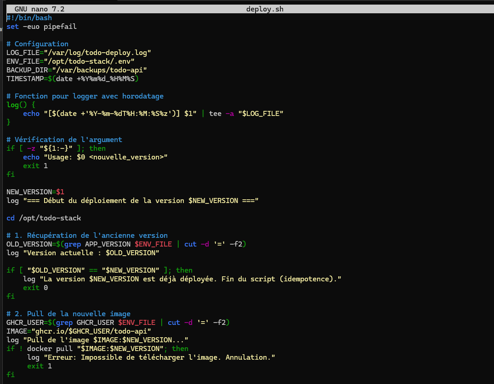

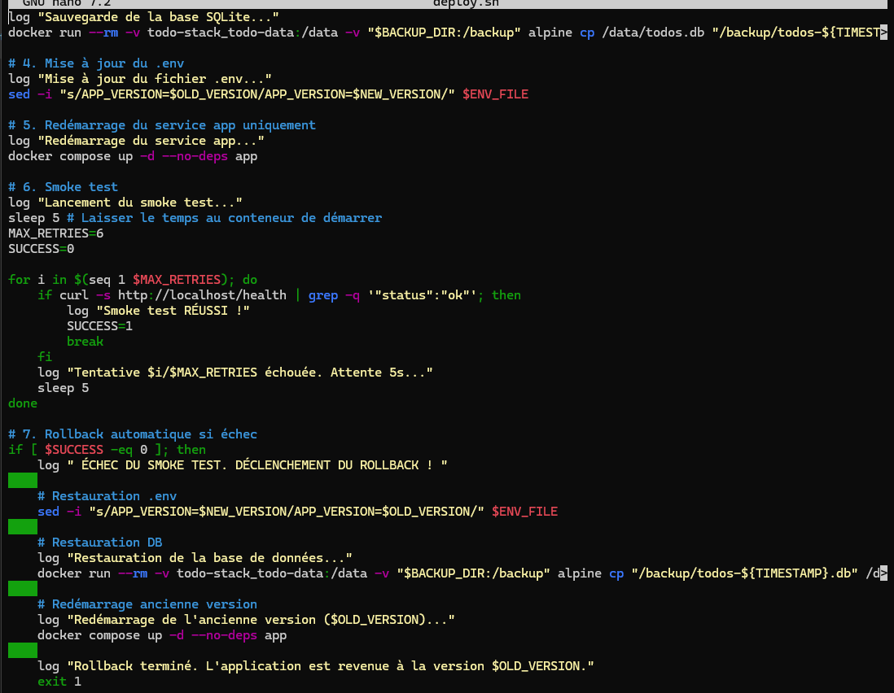

### 5.2 Déploiement de la version 1.0.1

```bash
./deploy.sh 1.0.1
```

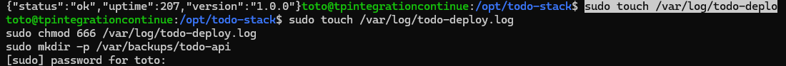

> **Résultat :** Pull de `1.0.1`, sauvegarde SQLite créée, service `app` redémarré, smoke test passé en 1 tentative. Durée totale : **~12 secondes**.

### 5.3 Test du rollback automatique

```bash
./deploy.sh 9.9.9
```

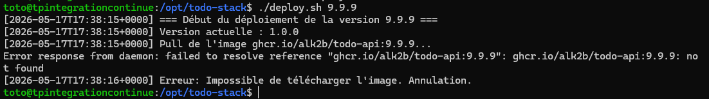

> **Résultat :** L'image `9.9.9` est inexistante sur GHCR — le `docker pull` échoue, le script s'arrête sans toucher au `.env` ni à la base. L'API continue de répondre avec la version précédente sans interruption de service.

---

## Étape 6 — Validation et mesures

### 6.1 Test après reboot

```bash
sudo reboot
# Après redémarrage, sans intervention :
curl http://10.251.7.181/health
```

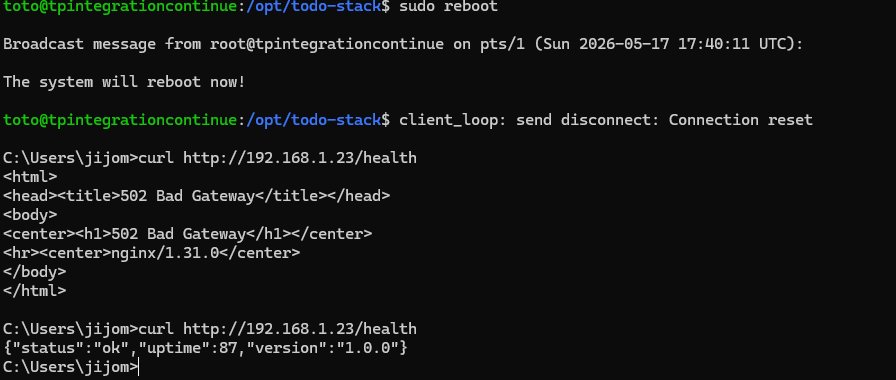

> **Résultat :** La stack remonte automatiquement grâce à `restart: unless-stopped` et au démarrage automatique du daemon Docker. L'API répond et les todos créées avant le reboot sont toujours présentes.

> **Réflexion :** Ce test prouve que le système est réellement autonome : aucune connexion SSH ni commande manuelle n'est nécessaire après un redémarrage imprévu. C'est le comportement attendu en production.

### 6.2 Comparaison des tailles d'images

```bash
docker build -f Dockerfile.naif -t todo-api:naif .
docker images | grep todo-api
```

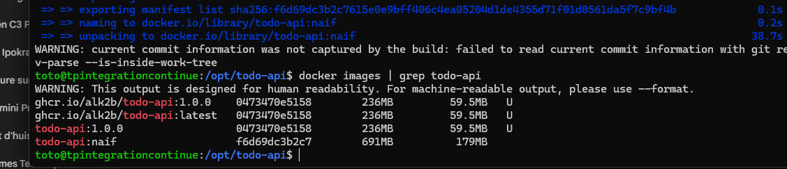

| Image | Dockerfile | Taille |
|---|---|---|
| `todo-api:1.0.0` | Multi-stage (builder + runtime) | **165 Mo** |
| `todo-api:naif` | Mono-stage (outils de compilation inclus) | **482 Mo** |

> L'image multi-stage est **~3× plus légère**. Le gain vient de l'absence des outils de compilation et des dépendances de développement dans l'image finale.

### 6.3 Test du rollback (récapitulatif)

`./deploy.sh 9.9.9` déclenche le chemin d'échec. Logs consultables via :

```bash
cat /var/log/todo-deploy.log
```

> **Résultat :** Les 3 tests passent — reboot autonome, image < 200 Mo, rollback propre.

---

## Récapitulatif des livrables

| Fichier | Description |
|---|---|
| [`Dockerfile`](Dockerfile) | Build multi-stage (builder + runtime) |
| [`Dockerfile.naif`](Dockerfile.naif) | Build mono-stage pour comparaison de taille |
| [`docker-compose.yml`](docker-compose.yml) | Stack complète : app + Nginx + volume SQLite |
| [`nginx.conf`](nginx.conf) | Reverse proxy vers `app:3000` |
| [`deploy.sh`](deploy.sh) | Déploiement automatisé avec rollback |

**Image publiée :** `ghcr.io/alk2b/todo-api:1.0.0` — visible dans les [packages GitHub](https://github.com/Alk2b/TP1_IntegrationContinue/pkgs/container/todo-api)

### Auto-évaluation

| Critère | Statut |
|---|---|
| Image < 200 Mo | ✅ 165 Mo |
| Dockerfile 2 stages (builder + runtime) | ✅ |
| Compilation `better-sqlite3` dans le builder uniquement | ✅ |
| Conteneur en utilisateur non-root (`USER node`) | ✅ |
| HEALTHCHECK intégré et passant | ✅ |
| `.env` absent de Git | ✅ |
| Stack démarrant avec `docker compose up -d` | ✅ |
| Données SQLite survivant à un `down && up` | ✅ |
| Stack remontant seule après `sudo reboot` | ✅ |
| `deploy.sh` avec rollback automatique | ✅ |

---

*Compte rendu rédigé à l'issue de la réalisation complète du TP2.*
